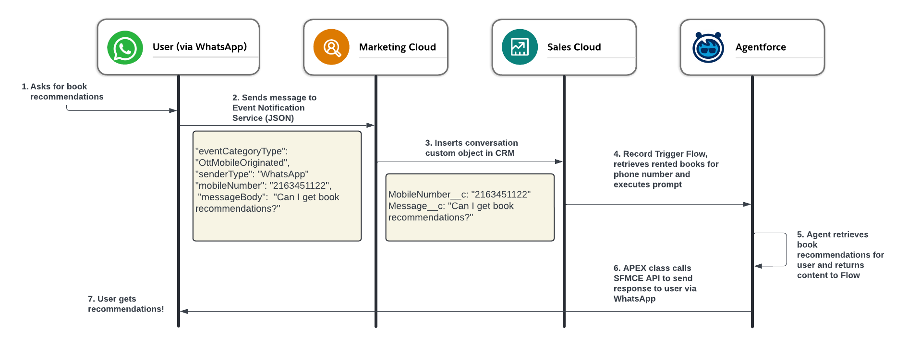
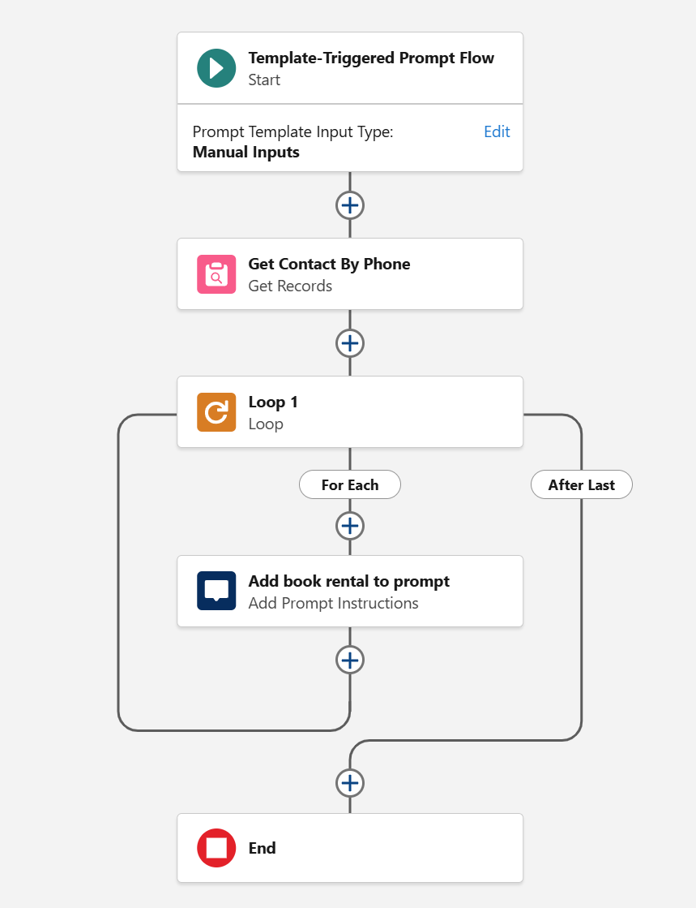
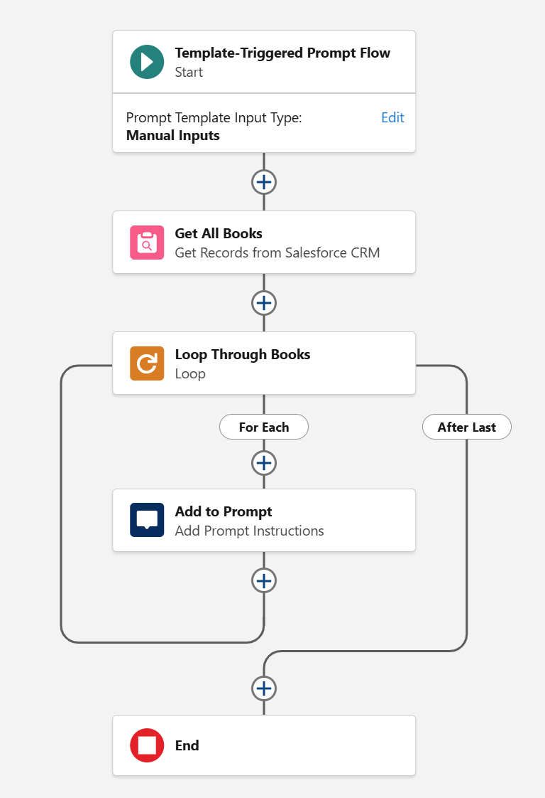
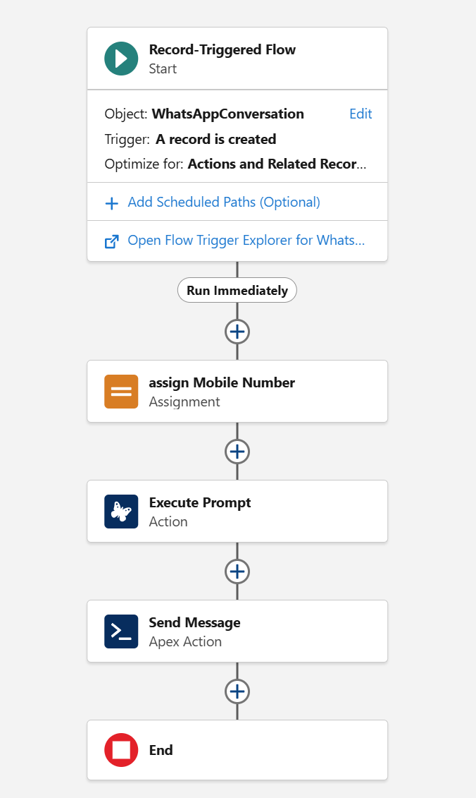

**Introduction**

This repository has components to implement an integration between Marketing Cloud Engagement with the Event Notification Service and Agentforce and is based on the presentation I did at [Buckeye Dreamin 2025](presentation/Buckeye Dreamin - Integrating WhatsApp with Agentforce.pdf).

While this is not a detail step by step instructin on how to implement the full solution, it should give you enough information to implement the same or a similar solution.

In order to implement this solution you will need:

1. A Marketing Cloud Engagement Account
2. A Sales Cloud Account
3. The Marketing Cloud Connector setup (MC Connect)
4. Agentforce

**PART I - Configuring ENS**

The first part of this solution entails configuring the event notification service in Marketing Cloud so inbound WhatsApp messages can be sent to Sales Cloud.

#### *Step 1: Create the VerificationKey Data Extension*
To get started using the ENS you need to set up a URL Callback. The URL Callback is the URL that will be called when an event happens.

However when you set up a URL Callback for the first time, you need to verify by confirming the Verification Key that will be sent to this URL. 

So we are going to set up a Data Extension that will store this Verification Key temporarily.

DE name: TransactionalSendsVerificationKey
Fields:
* Field Name: VerificationKey
* Field Type: Text (150)
* Required: Yes

#### *Step 2: Creating the Callback CloudPage*
Our second step will be setting up our Cloud Page that will receive the events from the ENS. Initially we are going to set up this Cloud Page to receive and store the verification code. 

Create a code resource Cloud Page and put the code located in sfmce/ens.verification.js. 

Copy the URL of this Cloud Page.

#### *Step 3: Create and Verify the Callback*
Go to: Setup → Feature Settings → URL Callbacks → click on Register New. 

Complete the details of your callback with the CloudPage URL you just created.

After your Callback is created, click on Verify. Open a new tab and go check your Data Extension to see the Verification Code Marketing Cloud send to verify your callback.

Copy and paste this verification code in the modal from the setup screen and you should be all set to start receiving events!

#### *Step 4: Modify the Callback CloudPage to Process Events from WhatsApp*
Go to your cloud page and modify it with the code from sfmce/whatsapp-ens-event.js which contains logic to receive an inbound message from WhatsApp and store it in a custom object in CRM using AMPScript (remember this will only work if you have setup the [integration between SFMCE and SFDC](https://help.salesforce.com/s/articleView?language=en_US&id=sf.mc_co_marketing_cloud_connect.htm)).

#### *Step 5: Create a Subscription*
Go to: Setup → Feature Settings → Subscriptions → click on Subscribe New. 

Select the Callback you created on step 3 and choose the EngagementEvents.OttMobileOriginated event.

Click on Subscribe.

**PART II - Configuring CRM & Agentforce**

This second part assumes you already have configured Agentforce in your org, if you need help getting started check out [this guide](https://developer.salesforce.com/agentforce-workshop/getting-started/guided-workshop-setup).

#### *Step 1 - Create The WhatsAppConversation Custom Object*

Create a custom object called WhatsAppConversation that will have two fields: MobileNumber (Text) and Body (Long Text Area). 

This object will get populated by our Marketing Cloud Engagement Cloud Page.

#### *Step 2 - Create Template Triggered Prompt Flows*

For this scenario, we will need two Tempate Triggered Prompt Flows that will populate data into the Prompt Template. 

One that will retrieve all books rented for a given phone number (which we will receive from WhatsApp/ENS) and another one that will retrieve all books available. 

This is how the Get Rented Books flow looks like:

And this is how the Get All Books flow looks like:

Note that both flows have an action to add the collection back to the prompt. We will create the prompt in the next step!

#### *Step 3 - Create the prompt*

Now we are going to create the prompt in prompt builder. For this you will go to Setup, search for Prompt Builder and create a new Flex Prompt Template. 

The Source object for this prompt template is going to be our WhatsAppConversation Custom object created in step 1.

Your Prompt will look like the following:

    You’re a book advisor at BooksForYou.com the number one online community for book readers.  
    At BooksForYou.com, people can connect their local library accounts and check out books to read online. 
    You should help people by providing recommendations based on their past book rentals, matching by Genre.
    When you receive a question, provide an answer following my instructions below.

    Instructions: 
    """
    Thank the user for contacting Books For You.
    Provide a list of 3 bullet points including Book Title and Abstract.
    Use clear, positive and straightforward language using the active voice and strictly avoiding the use of filler words and phrases and redundant language. Be conversational and friendly.
    Contact request: {!$Input:WhatsAppMO.Body__c}
    Contact Phone Number: {!$Input:WhatsAppMO.MobileNumber__c}
    List of books rented by contact: {!$Flow:GetRentedBooks.Prompt}
    List of all books available: {!$Flow:Get_All_Books.Prompt}
    """

Now save and activate the prompt template. 

**PART III - Putting it all together**

In this last part, we are going to create a flow and an Apex Class that will call the SFMCE Rest API to send the response of the prompt back to the user.

#### *Step 1 - Obtain SFMCE Credentials*

Login to SFMCE, navigate to Setup and search for Installed Packages.

Create a new installed package and add a Server-to-Server component. 

For the permissions, you just need the OTT permision to send. 

Copy the Client ID, Client Secret, the API domain and the SFMCE account ID, you will need this for the next step.

Check out [this resource](https://developer.salesforce.com/docs/marketing/marketing-cloud/guide/install-packages.html) if you need more information about creating installed packages.

#### *Step 2 - Create the Apex Class*

Create a new Apex Class called WhatsAppSFMCEService and copy the code from sfdc/WhatsAppSFMCEServiceTest.cls in this repo. 

Make sure you modify the class to include the details from your installed package you created in the previous step. 

If you need to create a test class, I also put one on this repo.

#### *Final Step - The flow that brings it all together*

The last step of our solution is to create a Flow that will trigger when a new WhatsAppConversation record is created, this flow will call our Prompt Template and then call our Apex Class with the mobile number and the Prompt Template response as a parameter:

#### Test your solution and modify it to your liking!

I hope this guide will help you understand how to integrate Agentforce with WhatsApp and other services using Prompt Builder, if you have any questions or feedback don't hesitate to contact me via [LinkedIn](https://www.linkedin.com/in/patosapir).

Thanks!
